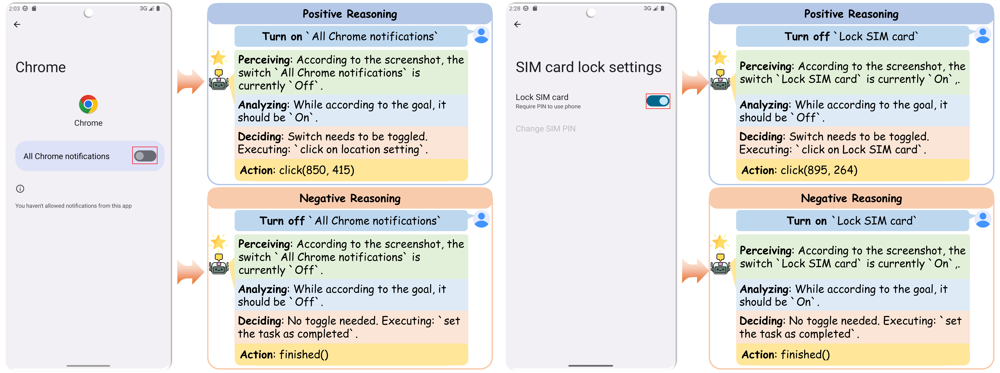

# ⭐ StaR
<div align="center">
  <h2 align="center">See, Think, Act: Teaching Multimodal Agents to Effectively Interact with GUI by Identifying Toggles</h2>
</div>

**This repository is the code implementation of our paper**
```
See, Think, Act: Teaching Multimodal Agents to Effectively Interact with GUI by Identifying Toggles
```
<div align="center">
  <a style="display: inline-block; text-align: center;">
      
  </a>
</div>

## 🚀 News

- 2025.9.17 We release the preprocess and evaluation code of our paper.
- 2025.9.17 We release the video demo of our paper.


##  Video Demo

We provide the video demo corresponding to the Section 5.5 of our paper. The target instruction is `turn wifi on`, with the toggle initially set to `on`, thereby serving as a test for false-positive toggling. The video demo is available at [VideoDemo](./VideoDemo.mp4). 

- OS-Atlas-7B without StaR fails to execute the instruction correctly, resulting in a false-positive toggle.  The agent mistakenly perceives the current toggle state as `off` and incorrectly clicks the toggle, resulting in an unintended state change. It then repeatedly toggles between `on` and `off`, falling into an infinite loop and ultimately failing the task.

- OS-Atlas-7B with StaR, by contrast, executes the instruction successfully. At the critical decision step, the agent adaptively applies the state-aware reasoning chain, correctly perceiving the current toggle state as *on* and appropriately deciding to finish the task, thereby completing the instruction as intended.


## Dependencies
- Install requirements by:
```bash
pip install -r requirements.txt
```
- For training the agents, we adopt the [LLaMA-Factory](https://github.com/hiyouga/LLaMA-Factory) framework. We provide the reference of the source code of 0.9.4.dev0 version. Navigate to the LLaMA-Factory directory and install the dependencies:
```
cd LLaMA-Factory
pip install -e ".[torch,metrics]" --no-build-isolation
```
- For evaluating the agent in the dynamic environment, we adopt the [AndroidWorld](https://github.com/google-research/android_world) framework. Please refer to their repository for deployment instructions.


## State Control Benchmark
We construct a state control benchmark with binary toggle instructions from public datasets to evaluate agent performance on toggle execution. 

Examples are provided in this repository:

- Benchmark samples: [Examples](./data/state/state_control_benchmark_sample.json)
- Corresponding screenshots: [ImagePaths](./GUIData/stateControlBenchmark)


## Data Preprocessing
Data preprocessing scripts are provided in the [dataPreprocessor](./dataPreprocessor/) directory. Hyperparameters are configured using YAML files.

Example: Preprocess State Control Benchmark for UI-TARS-7B
```yaml
type: state_cot
model: uitars
apiKey: "Your API key for zhipuai"
diversity: true
agentCount: 10
llamafactory: false
stateJsonPathTrain: ./data/state/state_control_benchmark_train.json
stateJsonPathTest: ./data/state/state_control_benchmark_test.json
```

Example: Preprocess AndroidControl Benchmark for UI-TARS-7B
```yaml
type: android_control
model: atlas
apiKey: "Your API key for zhipuai"
state: false
low_level: false
agentCount: 10
llamafactory: true
acjsonPath: GUIData/android_control/jsons
acimagePath: GUIData/android_control/images
aclayoutPath: GUIData/android_control/layouts
cot_trained: true
```

Example: Merge Data for AgentCPM-GUI-8B Training
```yaml
mergeConfigList: 
  - "dataPreprocessorYamls/acg/aitz_cot_trained_llamafactory.yaml"
  - "dataPreprocessorYamls/acg/androidControl_high_cot_trained_llamafactory.yaml"
  - "dataPreprocessorYamls/acg/androidControl_low_cot_trained_llamafactory.yaml"
  - "dataPreprocessorYamls/acg/gui_odyssey_cot_trained_llamafactory.yaml"
  - "dataPreprocessorYamls/acg/state_cot_llama_factory.yaml"
model: agentcpmgui
type: agentic_with_state_cot
```

To preprocess data, run:
```bash
python preprocessData.py --config <path to config yaml> --mergeConfig <path to merge config yaml> 
```

## Train the Agents
The implementation of training the agents are based on [LLaMA-Factory](https://github.com/hiyouga/LLaMA-Factory). After preprocessing and merging the data, configure the training settings in LLaMA-Factory. (see [Preprocess the Data](#data-preprocessing) for more details). See [README](./LLaMA-Factory/README.md) for more details.


## Evaluate the Agent on Agentic Benchmarks
Evaluation scripts are provided in the [evaluator](./evaluator/) directory. Hyperparameters are configured via YAML files.

Example: Evaluate UI-TARS-7B on State Control Benchmark
```yaml
testJsonPath: "test Json path in data/GUIState/uitars"
modelPath: "path to the agent model"
devicesIDs: "CUDA device IDs for evaluation, such as [0,1,2,3]"
agentCount: 4 # The process number of the evaluation
agentType: uitars
max_new_tokens: 512
benchmarkSetting: high
type: state_action # see (./evaluator/evaluators.py)
recordSavePath: uitars_state_action_predict_test.json # save record file name in ./analyses
```

Example: Evaluate OS-Atlas-7B on AndroidControl-H Benchmark

```yaml
testJsonPath: "test Json path in data/GUIAgentic/android_control/atlas/"
modelPath: "path to the agent model"
devicesIDs: "CUDA device IDs for evaluation, such as [0,1,2,3]"
agentCount: 4 # The process number of the evaluation
agentType: atlas
max_new_tokens: 512
benchmarkSetting: high
type: android_control
recordSavePath: atlas_android_control_high_action_predict_test.json # save record file name in ./analyses
```

To evaluate:
```bash
python evaluate.py --config <path to config yaml>
```

## Evaluate the Agent on Dynamic Environment
To further assess real-world applicability, we construct a dynamic evaluation benchmark consisting of 20 real-world toggle control tasks. This benchmark is implemented on the Android emulator from [AndroidStudio](https://developer.android.com/studio) and built upon the [AndroidWorld](https://github.com/google-research/android_world) framework, enabling evaluation under dynamic and realistic mobile environments. See [README](./android_world/README.md) for more details.


## Acknowledgement
This work can not be done without the help of the following repos:

- [LLaMA-Factory](https://github.com/hiyouga/LLaMA-Factory)
- [AndroidWorld](https://github.com/google-research/android_world)
    